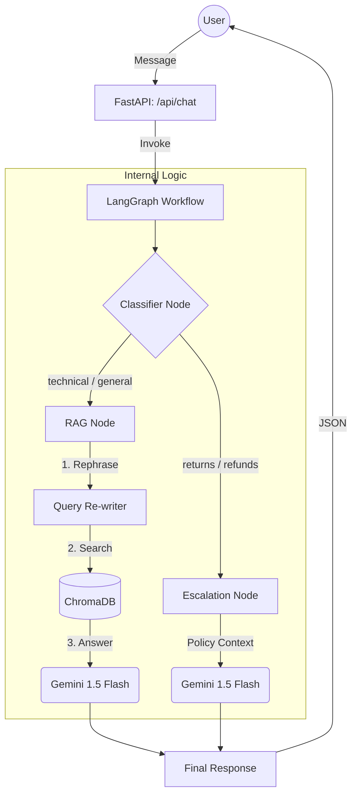

# TechGear Assistant: AI-Powered Customer Support

TechGear Assistant is a premium, RAG-based (Retrieval-Augmented Generation) chatbot designed for modern electronics support. It combines advanced contextual reasoning with a visual-first, dark-themed interface.

## 🚀 Key Features

- **Contextual Memory**: Understands follow-up questions (e.g., "Tell me more about the last one") using query re-writing logic.
- **Smart Restart**: Clear the AI's session context without losing your persistent history tab.
- **Intelligent Routing**: Uses **LangGraph** to classify queries and route them to specific nodes (Technical, Returns, General).
- **RAG-Powered Answers**: Retrieves accurate product information from a high-quality vector database (**ChromaDB**).
- **Premium UI**: Glassmorphism design with smooth animations and a dedicated History tab.
- **Support Supervision**: Specialized handling for returns and refunds using policy-aware escalation logic.

## 🛠️ Tech Stack

- **Backend**: [FastAPI](https://fastapi.tiangolo.com/)
- **Orchestration**: [LangGraph](https://langchain-ai.github.io/langgraph/) & [LangChain](https://python.langchain.com/)
- **LLM**: [Google Gemini 1.5 Flash](https://deepmind.google/technologies/gemini/)
- **Embeddings**: `text-embedding-004`
- **Vector Store**: [ChromaDB](https://www.trychroma.com/)
- **Frontend**: Vanilla CSS (Glassmorphism), HTML5, JavaScript

## 📦 Project Structure

```text
customer_support_chatbot/
├── app/
│   ├── graph.py          # LangGraph workflow & node logic
│   ├── main.py           # FastAPI endpoints & core server
│   ├── models.py         # Pydantic data schemas
│   ├── rag.py            # RAG chain & query re-writing
│   └── ingest.py         # Vector DB ingestion logic
├── data/
│   └── knowledge_base.txt # Synthetic product data
├── static/
│   ├── index.html        # Main dashboard
│   ├── style.css         # Premium dark-mode styling
│   └── script.js         # Frontend interaction logic
├── generate_data.py      # Script to create synthetic data
├── requirements.txt      # Python dependencies
└── run.py                # Server entry point
```

## ⚙️ Setup & Installation

1. **Install Dependencies**:
   ```bash
   pip install -r requirements.txt
   ```

2. **Configure Environment**:
   Create a `.env` file in the root directory:
   ```text
   GEMINI_API_KEY=your_gemini_api_key_here
   ```

3. **Prepare Data**:
   ```bash
   # Generate synthetic product data
   python3 generate_data.py
   
   # Ingest data into the vector store
   python3 -m app.ingest
   ```

4. **Run the Application**:
   ```bash
   python3 run.py
   ```
   Open [http://localhost:8000](http://localhost:8000) in your browser.

## 🤖 Architecture

The system uses a non-linear workflow orchestrated by **LangGraph**:



### How It Works (Step-by-Step)

| Step | Component | What Happens |
|------|-----------|--------------|
| 1 | **User** | Sends a message via the chat UI |
| 2 | **FastAPI** (`main.py`) | Receives the request at `/api/chat` |
| 3 | **LangGraph** (`graph.py`) | Invokes the conversation workflow |
| 4 | **Classifier Node** | Analyzes intent: is it a product question or a return/refund? |
| 5a | **RAG Node** (`rag.py`) | For product questions: re-phrases the query using history, searches ChromaDB, and generates an answer |
| 5b | **Escalation Node** | For returns: uses policy context to provide empathetic responses |
| 6 | **Response** | Final answer is sent back to the user as JSON |

### Key Files to Explore

| File | Purpose |
|------|---------|
| `run.py` | Entry point – start here |
| `app/main.py` | API endpoints and server logic |
| `app/graph.py` | LangGraph workflow with nodes and edges |
| `app/rag.py` | RAG chain with query re-writing |
| `static/index.html` | Frontend UI |

---
Created with ❤️ by the TechGear Team.

